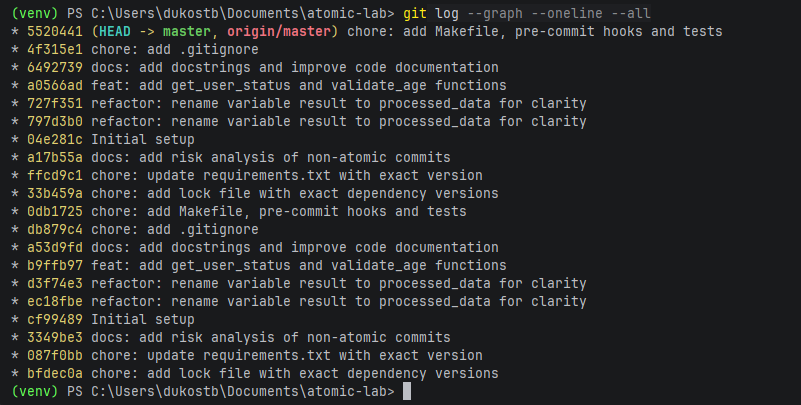
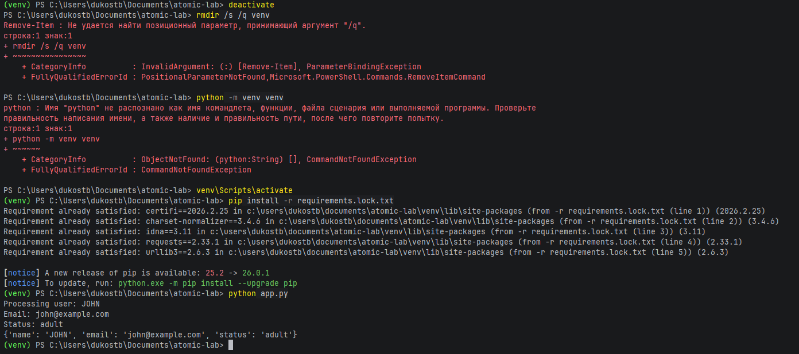
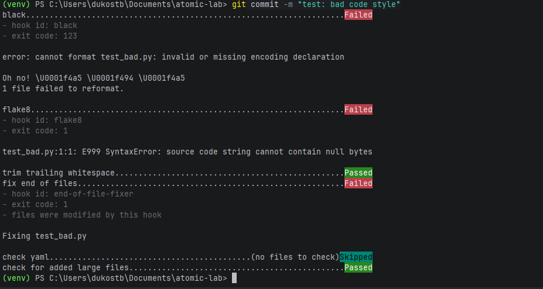

# Практическая работа: Локальный рабочий процесс

**Студент:** Зозуля Мария

## Ссылка на репозиторий
[https://github.com/mariyaproZZZ/atomic-lab](https://github.com/mariyaproZZZ/atomic-lab)

## Скриншоты

### 1. Атомарность коммитов


### 2. Чистый старт (воспроизводимость окружения)


### 3. Pre-commit хук (блокировка коммита)


## Ответы на контрольные вопросы

### 1. Как использование git add -p помогает при отладке через git bisect?
`git add -p` позволяет разбить большой набор изменений на несколько атомарных коммитов, каждый из которых содержит только одно логическое изменение. При использовании `git bisect` для поиска бага это позволяет точно локализовать коммит, который ввел ошибку. Если бы все изменения были в одном коммите, пришлось бы вручную разбираться, какое именно изменение вызвало проблему.

### 2. Почему requirements.lock.txt критичен для командной работы?
`requirements.lock.txt` фиксирует точные версии **всех** зависимостей, включая транзитивные (зависимости зависимостей). Это гарантирует, что все разработчики и production-окружение используют идентичный набор пакетов. Обычный `requirements.txt` может содержать только основные зависимости без версий или с диапазонами, что приводит к несоответствиям на разных машинах.

### 3. В чем преимущество Makefile перед текстовой инструкцией в README?
Makefile является **исполняемой документацией**:
- Автоматизирует повторяющиеся задачи
- Уменьшает человеческие ошибки при вводе команд
- Обеспечивает единообразие процесса для всей команды
- Поддерживает зависимости между задачами (например, `test` зависит от `install`)

### 4. Как тесты реализуют принцип «живой документации» и почему фиксация seed важна?
Тесты со структурой Given-When-Then показывают, как должно работать приложение, и всегда актуальны (в отличие от обычной документации, которая может устареть). Фиксация `random.seed()` важна для воспроизводимости — при одинаковом seed генератор случайных чисел выдает одинаковую последовательность, что делает тесты детерминированными и предсказуемыми.

### 5. Что произойдет, если удалить папку venv и выполнить make install?
При удалении `venv` и выполнении `make install`:
1. Будет создано новое виртуальное окружение
2. Установятся все зависимости из `requirements.lock.txt` с точными версиями
3. Приложение будет работать идентично предыдущему запуску
Это демонстрирует **воспроизводимость** окружения.

## Выполненные этапы

| Этап | Описание | Статус |
|------|----------|--------|
| 1 | Эмуляция нарушений и анализ | ✅ |
| 2 | Атомарность через интерактивный стейджинг | ✅ |
| 3 | Обеспечение воспроизводимости | ✅ |
| 4 | Документирование и автоматизация качества | ✅ |


## Файлы в репозитории

- `app.py` — основное приложение
- `test_app.py` — тесты с структурой Given-When-Then
- `Makefile` — автоматизация задач (install, lint, test, run)
- `.pre-commit-config.yaml` — pre-commit хуки (black, flake8)
- `requirements.txt` — основные зависимости с версиями
- `requirements.lock.txt` — все зависимости с точными версиями
- `.gitignore` — игнорируемые файлы
- `analysis.md` — анализ рисков неатомарных коммитов


## 🚀 Запуск приложения

```bash
python -m venv venv
venv\Scripts\activate
pip install -r requirements.lock.txt
python app.py
